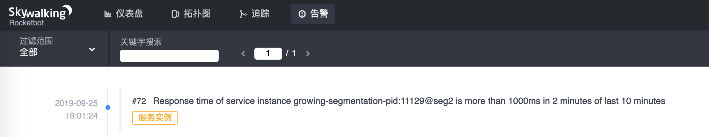
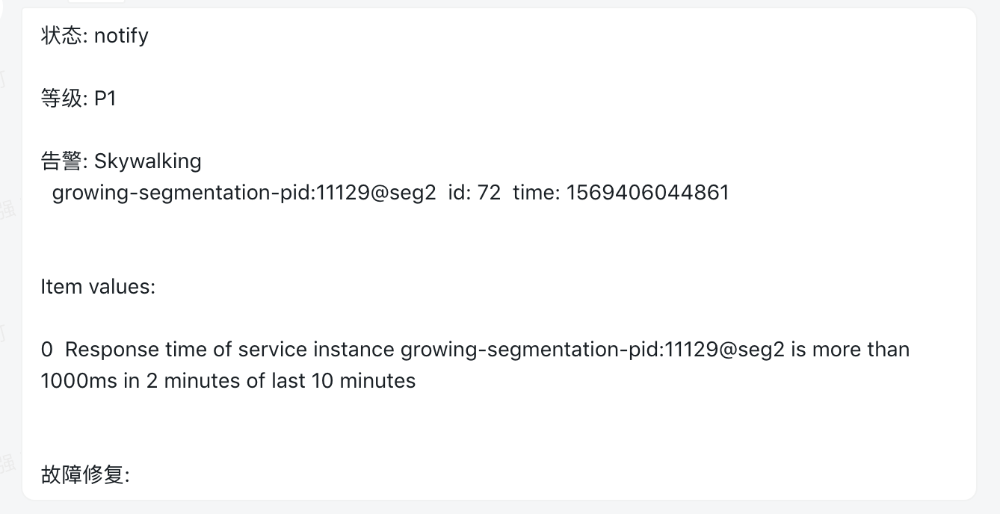

# golang-skywalking-webhook
skywalking alarm webhook


- install
```bash
go get -u github.com/weiqiang333/golang-skywalking-webhook
cd $GOPATH/src/github.com/weiqiang333/golang-skywalking-webhook/
bash build/build.sh
./bin/golang-skywalking-webhook help
```

- Example
```bash
./bin/golang-skywalking-webhook --config configs/conf.yml
```

# Demonstration

<p align="center">-SkyWalking alarm UI-</p>


<p align="center">-dingtalk message body-</p>
